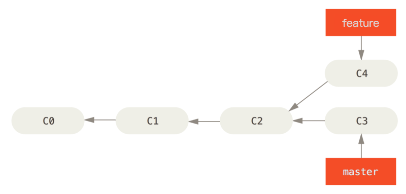
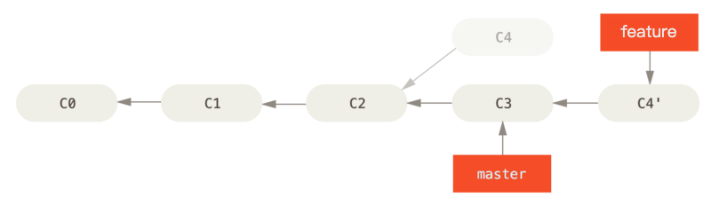
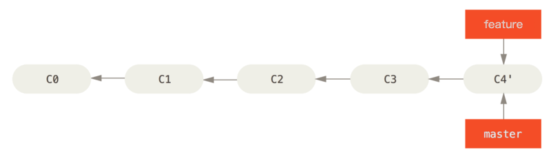

# 代码合并之使用 `rebase` 整理提交历史

Git 中整合来自不同分支的修改有两种方式：`git merge` 和 `git rebase`。本文主要介绍 `rebase` 的3种使用场景：

1. 使用 rebase 合并分支--整合分叉的提交历史
2. 使用 交互式的 rebase 压缩提交历史
3. 使用 交互式的 rebase 修改多个提交信息

## 1 使用 rebase 合并分支

### 1.1 场景描述

我们在 feature 分支开发完新的功能后，通常会通过 merge 操作将代码合并到 master 分支，这样会产生一条分叉。这时可以通过变基**使得提交历史更加整洁**，看上去就像是串行的一样，提交历史是一条直线没有分叉。

首先在自己的 feature 分支里进行开发，当开发完成时你需要先将你的代码变基到 `master` 上，然后再向 master 分支提交修改。 这样的话，该项目的维护者就不再需要进行整合工作，只需要快进合并便可。

### 1.2 操作命令

```bash
#步骤1
git checkout feature
git rebase master

# 步骤2:回到 master 分支，进行一次快进合并。
git checkout master
git merge feature
```

### 1.3 原理图解

假设在你的项目上 master 分支的提交为C0、C1、C2、C3，基于 master 的 `C2` 节点拉出了一个 `feature` 分支，并产生了新的提交C4，如下图：



整个变基操作的过程如下图所示，首先找到这两个分支（即当前分支 `feature`、变基操作的目标基底分支 `master`） 的最近共同祖先 `C2`，然后对比当前分支相对于该祖先的历次提交，提取相应的修改并存为临时文件， 然后将当前分支（feature）指向目标基底 `C3`, 最后以此将之前另存为临时文件的修改依序应用，此时 `feature` 指向 `C4'`。 




最后回到 `master` 分支，进行一次快进合并，完成后 `feature` 和 `master` 分支均指向 `C4`，如下图所示。



至此合并分支操作完成，`master` 的提交历史是一条干净的、没有分叉的直线。

## 2 使用 交互式的 rebase 压缩提交历史

通过给 `git rebase` 增加 `-i` 选项来交互式地运行变基。 一般被用于将 feature 分支并入 master 分支之前，清理混乱的提交历史。

### 2.1 场景描述

将一连串提交压缩成一个单独的提交。

### 2.2 操作命令

假设将 feature 分支当前的3个提交变为一个提交，操作如下：

```bash
# 1.执行交互式 rebase
git rebase -i HEAD~3

# 2.进入编辑器，将要被压缩的提交改为squash
pick f7f3f6d changed my name a bit
squash 310154e updated README formatting and added blame
squash a5f4a0d added cat-file

# 3.最后保存并退出编辑器时，Git 应用所有的三次修改然后将你放到编辑器中来合并三次提交信息：
```

注意其中的反序显示。 交互式变基给你一个它将会运行的脚本。 它将会从你在命令行中指定的提交（`HEAD~3`）开始，从上到下的依次重演每一个提交引入的修改。 它将最旧的而不是最新的列在上面，因为那会是第一个将要重演的。

## 3 修改多个提交信息

### 3.1 场景描述

### 3.2 操作命令

```bash

```


## 4 注意事项

要用它得遵守一条准则：

**如果提交存在于你的仓库之外，而别人可能基于这些提交进行开发，那么不要执行变基。**

