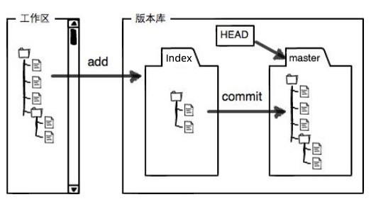
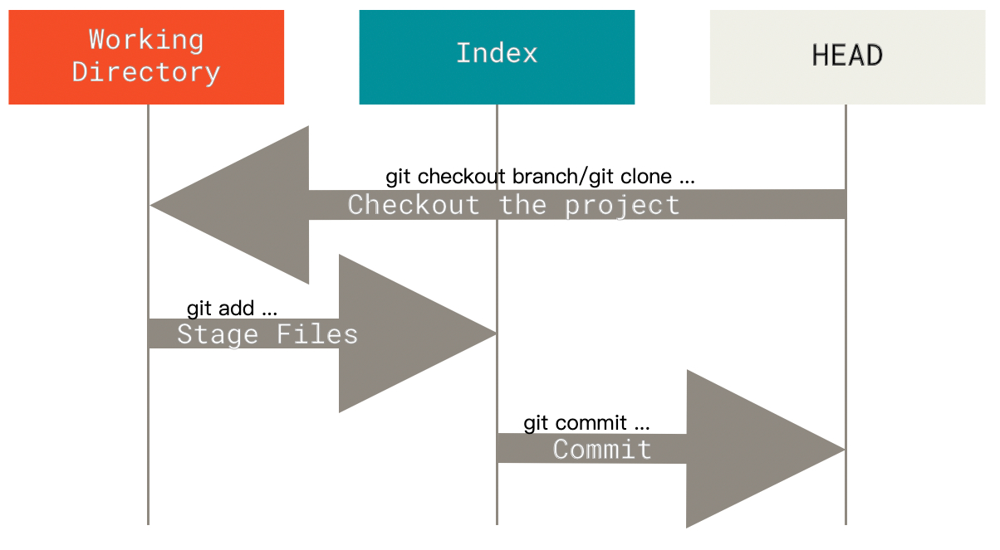

# Git的工作区、暂存区、版本库及工作流程

## 1 工作区、暂存区、版本库

Git 思维框架的三个重要概念：

- 工作区（Working Directory）：从 Git 版本库解包出来的实际可编辑的文件，放在磁盘上供我们使用或修改，即我们能直接看到的项目目录。
- 暂存区（Index/Stage）：是一个文件，实际位于 `.git/index`，所以把暂存区也叫做索引（Index），保存了下次将要提交的文件列表信息。
- Git 版本库（.git directory）：就是我们项目目录下的 `.git` 目录中的内容，是 Git 用来保存项目的元数据和对象数据库的地方。 这是 Git 中最重要的部分，从其它计算机克隆仓库时，复制的就是这里的数据。

工作区、暂存区、版本库之间的关系如下图🐰：

1. 图中在版本库中标记为 "Index" 的区域是暂存区，标记为 "master" 的是 `master` 分支所代表的目录树。
2. 图中我们可以看出此时 "HEAD" 实际是指向 `master` 分支的一个"游标"，通常 `HEAD` 是当前分支引用的指针，它总是指向该分支上的最后一次提交。
3. 当对工作区修改（或新增）的文件执行 `git add` 命令时，暂存区的目录树被更新。
4. 当执行提交操作 `git commit` 时，暂存区的目录树写到对象库（./git/objects）中，master 分支会做相应的更新。

## 2 工作流程

经典的 Git 工作流程是通过操纵 工作区、暂存区、HEAD 这三个区域来实现，如下图:

1. 图中当检出/克隆一个分支时，它会修改 HEAD 指向新的分支引用，将 **索引** 填充为该次提交的快照， 然后将 **索引** 的内容复制到 **工作目录** 中。
2. 使用 `git add` 来将修改/添加的文件暂存到 **索引** 中。
3. 使用 `git commit` 来提交暂存区内容到对象库，对应分支更新，使 `HEAD` 指向最新提交。